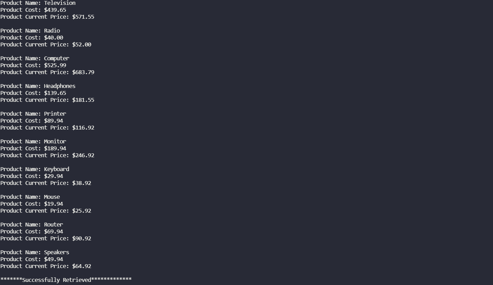

# Inventory-Markup
Java CLI Inventory Markup Program

This is a program that uses a loop to read a Data.txt file from your hard drive and creates an inventory report based on the data in the file. 
The program will write back to the hard drive creating a file called Inventory.txt. The program’s purpose is to add the designated markup cost to products.
The program then outputs the product names, original raw-costs, and product costs after markup (calculated using the formula itemCost(x) * 1.3).

## Installation

To use this application you will need Java SE installed on your machine. If you do not have Java SE installed, you can download it [here](https://www.oracle.com/java/technologies/javase-downloads.html).

You will need to compile this program by running:
```
javac Main.java
```

Followed by:
```
java Main
```

## Screenshots


